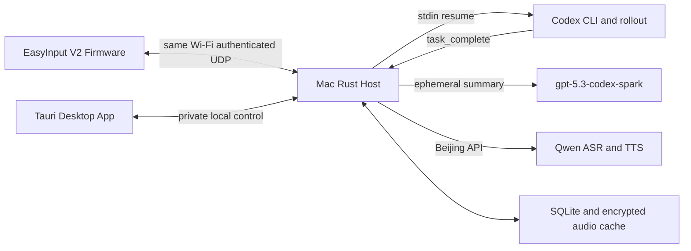

# Codex Keyboard 本地 Wi-Fi 总体方案

## 产品定义

Codex Keyboard 是一个四槽实体 Codex 终端。EasyInput V2 和 Mac 必须在同一局域网：

| 按键 | 行为 |
|---|---|
| S1-S4 | 对槽位 1-4 按住说话，松开后 ASR 并进入对应 Codex task FIFO |
| S5-S8 | 播放槽位 1-4 最新未读完成总结 |

绑定不写入固件。桌面 App 从本机 Codex catalog 选择 task，Host 原子保存 `slot -> task UUID`；
固件永远只发送 `slot=1..4`。

## 部署单元



本仓没有 PWA、Cloudflare、Relay、手机播放或远程路径。Host 和键盘之间没有公网依赖；Qwen 与
Codex 模型调用仍需要 Mac 具备互联网连接。

## Source of Truth

| 对象 | 唯一所有者 |
|---|---|
| 四槽绑定、prompt FIFO、completion cursor | Host SQLite |
| 未读 summary generation、playback lease | Host SQLite |
| WAV/EIAD 密文缓存 | Host 私有文件系统 |
| Codex task transcript | Codex 本地状态 |
| 按键、连接 generation、采集/播放 buffer | Firmware RAM/PSRAM |
| Wi-Fi SSID/密码、Host IPv4/port、device secret | Firmware NVS |

## 上排语音链

1. S1-S4 按下后固件先抢占播放，再启动 16 kHz mono PCM16 采集。
2. EICC 控制会话建立后，EIAU v3 帧携带 slot、capture generation、route generation、sequence 和 HMAC。
3. Host 严格验证来源、鉴权、顺序、长度和结束包；空音频、缺帧、旧 generation 均拒绝。
4. Host 默认调用北京区 `qwen3-asr-flash`，成功文本以 durable request 写入 task FIFO。
5. 同 task 永不并发，prompt 经 stdin 传给 `codex exec resume --json <task-id> -`。

## 总结与音频

只有 rollout 权威 `task_complete` 才推进 completion ledger。Host 以隔离临时 `CODEX_HOME` 调用
`gpt-5.3-codex-spark`，把上一版未听摘要与新完成内容合并，再调用北京区
`qwen3-tts-instruct-flash-realtime`。只有服务端完成事件、PCM 校验、WAV/EIAD 编码、加密和 fsync
全部成功后，才原子发布新 generation。

缓存位于：

```text
~/Library/Application Support/EasyCodexInput/cache/
```

DashScope key 只在同一 App Support 根下的 mode-0600 `.env`；cache/device secret 也只在本机私有文件。

## 下排播放链

1. S5-S8 发送带单调 request generation 的 EIPR。
2. Host 取得对应 task 当前未读 generation 的 exact playback lease。
3. EIPB/EIPD 把 EIAD 加密下发；固件当前候选先完整放入 PSRAM，再复用 EIAD decoder/I2S worker。
4. 固件实际排空 I2S 和尾静音后发送 EIPF；Host 完成 heard/cache transaction 后返回 EIPK。
5. ACK 丢失可重发；旧 generation、取消、PTT 抢占、超时、断线和播放失败均不能删除缓存。

当前完整 PSRAM 预下载只是真机候选。发布版仍需升级为有界 jitter/ring 边下边播。

## 配网

首选 Mac 通过 USB HID 管理 report 下发与 BLE GATT 相同的 S3C 配置。密码从 stdin 读取，不进入
argv、日志或数据库。USB 不可用时可使用 BLE GATT；运行时音频始终只走 Wi-Fi。

## 验收边界

- Rust/TypeScript/C++ 自动化证明协议和状态机，不证明扬声器可听。
- ESP-IDF build 证明镜像可生成，不证明可安全烧录。
- Host `healthy=true` 证明常驻服务，不证明键盘网络或 I2S。
- 最终产品必须用真实键盘、真实局域网、真实 Qwen/Codex 和 exact cache deletion 分别验收。
