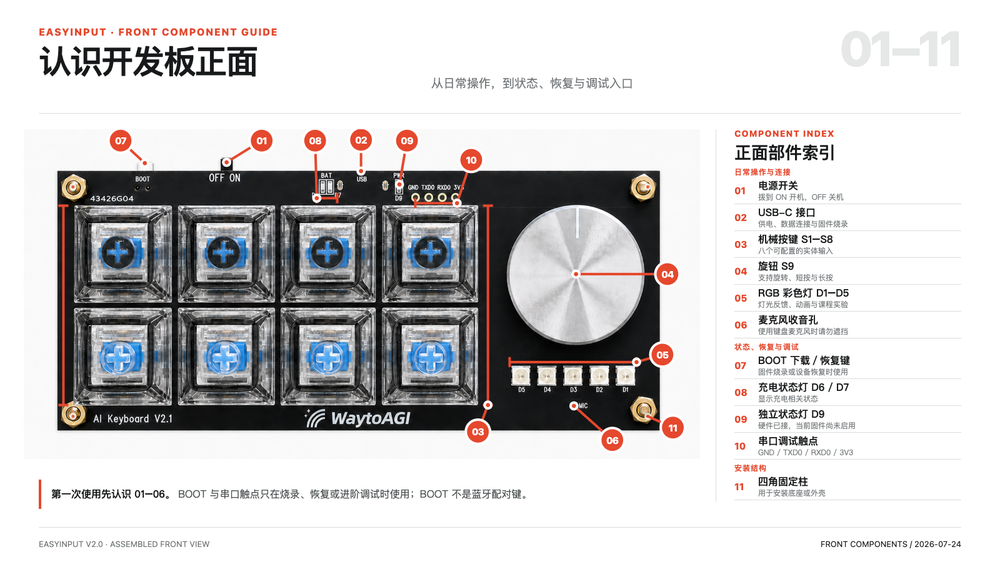
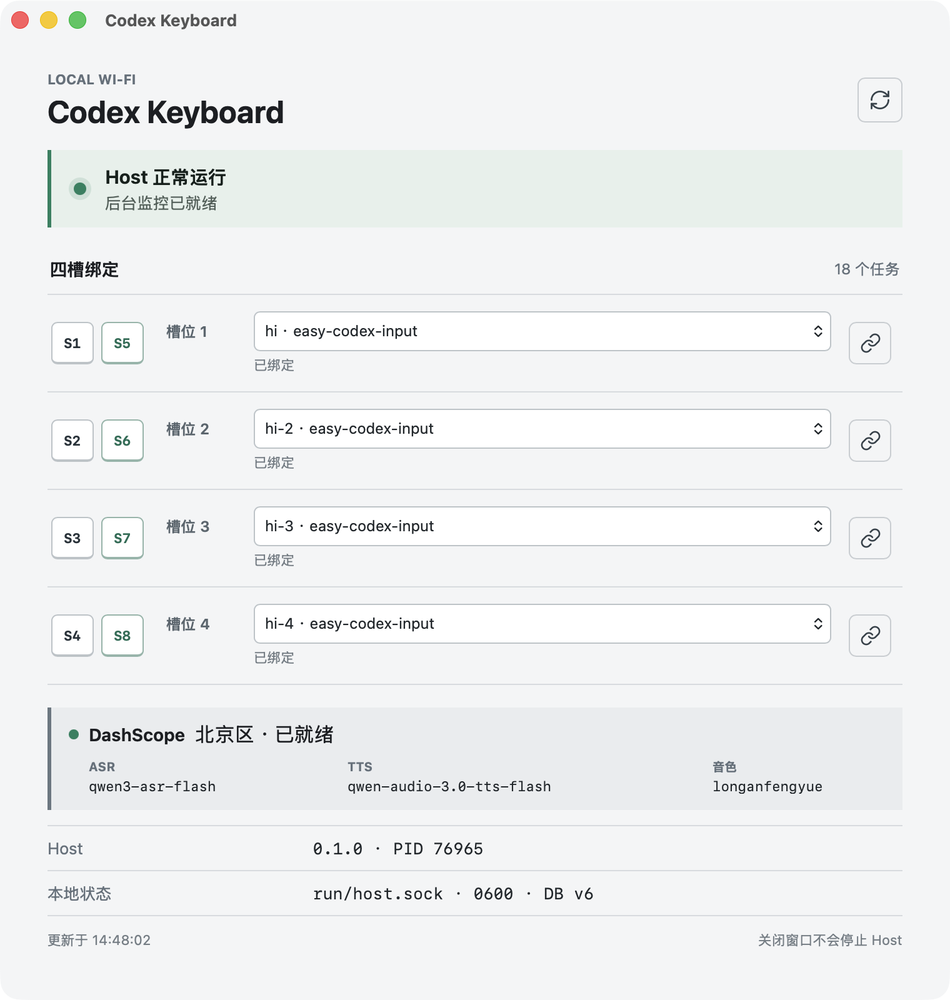

# 《Codex 任务电台》训练营学员手册

> 案例：一把键盘，远程开发
>
> 讲师：Lark
>
> 课程版本：`v0.1.0-local-training`
>
> 代码仓库：<https://github.com/Larkspur-Wang/Codex_Keyboard>

## 1. 这份手册怎么用

这不是 PPT 的逐字稿，而是一份课后还能继续使用的操作手册。学员可以用它完成三件事：

1. 在三分钟内看懂这套设备解决什么问题。
2. 在已经准备好的 Mac 和键盘上完成一轮真实操作。
3. 回到代码仓库后，知道 App、Host、固件和模型分别负责什么。

本手册锁定训练营标签 `v0.1.0-local-training`。后续代码继续变化时，先以标签版本复现课程，再对照
`main` 分支查看新改动。

## 2. 先看结果



这把键盘连接四个 Codex 任务。你可以把四个任务理解成四个工作频道：

- 按住上排 `S1-S4` 中的一个键，对对应任务说要求。
- 松开后，Mac 把语音转成文字，并将要求排入对应 Codex 任务。
- Codex 在后台工作，人可以离开屏幕处理别的事情。
- 任务完成并生成语音总结后，左侧对应的信箱灯亮起。
- 按一下下排 `S5-S8` 中对应的键，键盘播放这条总结。
- 完整播放结束后，这条总结才算听过，对应灯熄灭，缓存被删除。

一句话概括：**它把四个 Codex 任务变成了四个可说、可听、会亮灯的实体频道。**

## 3. 为什么会想到这个案例

这个想法不是从“ESP32 还能做什么”开始的，而是从日常工作里的三个小麻烦开始：

1. 很多要求说一句就够了，但仍要回到电脑前打字。
2. 同时跑多个 Codex 任务时，需要不断切窗口确认状态。
3. 明明任务可以在后台完成，人却总忍不住守着屏幕等结果。

模型可以同时工作，人只有一双手。真正打断工作的，往往不是写代码本身，而是下要求、看状态、收结果
这些反复发生的小动作。

EasyInput V2 正好提供了八个键、五颗灯、麦克风、Wi-Fi、PSRAM 和扬声器链路。八个键天然可以分成
上下两排：上排说，下排听。于是，一把快捷键键盘变成了四频道任务电台。

## 4. 认识键盘上的每个动作

### 4.1 八个按键

| 槽位 | 说入任务 | 收听总结 | 对应关系 |
|---|---|---|---|
| 槽 1 | 按住 `S1` | 按一下 `S5` | `S1 -> S5` |
| 槽 2 | 按住 `S2` | 按一下 `S6` | `S2 -> S6` |
| 槽 3 | 按住 `S3` | 按一下 `S7` | `S3 -> S7` |
| 槽 4 | 按住 `S4` | 按一下 `S8` | `S4 -> S8` |

上排必须按住说话，松开才结束录音。下排是短按播放，不需要按住。

### 4.2 五颗灯

五颗灯承担两种不同职责：

| 灯 | 含义 |
|---|---|
| 左起第 1-4 颗 | 分别表示槽 1-4 是否有未听总结；同一槽累计内容越多，灯越亮 |
| 最右第 5 颗 | 表示当前有几个不同的绑定任务正在运行 |

第五颗灯的颜色：

| 运行任务数 | 颜色 |
|---:|---|
| 0 | 绿色 |
| 1 | 黄色 |
| 2 | 橙色 |
| 3 | 紫色 |
| 4 | 红色 |

同一个任务中的多条要求仍按 FIFO 排队，不会为了显示红灯而并发写入同一段对话。要看到红灯，四个槽
需要绑定四个不同任务，并在前一个任务完成前依次提交四条要求。

按键、录音、播放和错误提示会短暂覆盖灯光。短时反馈结束后，灯条会恢复最新的任务和信箱状态。

### 4.3 旋钮

- 逆时针：降低键盘板载扬声器音量。
- 顺时针：提高键盘板载扬声器音量。
- 短按：播放“当前音量百分之 X”。
- 长按 3 秒：进入键盘配置模式。

音量共 10 档，从 10% 到 100%，默认 70%。调整后会保存到键盘 NVS，重启后继续使用。它控制的是
键盘自己的扬声器，不是 Mac 系统音量。

## 5. 系统里有哪几部分



可以把整套系统理解成三个角色：

| 角色 | 负责什么 |
|---|---|
| 键盘 | 收声音、传声音、亮灯、播放声音 |
| Mac Host | 绑定任务、维护队列、观察完成、生成总结、保存音频、管理状态 |
| Codex | 真正修改代码、运行命令、完成任务 |

桌面 App 是管理界面。它从 Host 读取状态，并把四个槽绑定到本机已有的 Codex 任务。关闭 App 窗口不会
停止后台 Host，也不会停止正在运行的任务、总结和信箱。

### 5.1 通俗版架构

```text
说进去：键盘 -> 本地 Wi-Fi -> Mac Host -> 千问 ASR -> Codex 任务

做任务：Codex 任务 -> 修改代码 / 运行测试 -> task_complete

听回来：task_complete -> Luna High 总结 -> 千问 TTS -> Mac 加密缓存
          -> 本地 Wi-Fi -> 键盘扬声器
```

键盘和 Mac 必须在同一个局域网。键盘与 Host 之间的声音和状态不经过公网；但 Codex、千问 ASR 和
千问 TTS 仍需要 Mac 能访问互联网。

### 5.2 为什么绑定存在 Mac，而不是固件里

固件只认识 `slot=1..4`，不保存 Codex 任务 ID，也不保存对话内容。

这样做有三个好处：

1. 换任务时不用重刷固件。
2. 真实任务信息不会进入键盘和公开日志。
3. SQLite、队列和缓存只由 Host 管理，不会出现 App 和固件各有一份状态。

## 6. 一条要求是怎么走完的

### 6.1 语音输入

1. 按住 `S1-S4` 中的一个键。
2. 键盘先停止可能正在播放的总结，再开始采集 16 kHz 单声道 PCM 音频。
3. 音频通过带认证的局域网数据包发给 Mac Host。
4. 松开按键后，Host 整理音频并调用北京区 `qwen3-asr-flash`。
5. 识别文本先写入持久队列，再通过标准输入交给对应的 `codex exec resume`。
6. 同一个任务中的要求严格按顺序执行，不会互相覆盖。

语音建议说成一条完整、可执行的要求，例如：

> 检查当前测试失败的原因，修复以后运行相关测试，并告诉我改了什么。

不要只说“继续”“看一下”这类缺少上下文的指令，除非绑定任务里的上下文已经非常明确。

### 6.2 任务完成与总结

系统只认 Codex rollout 的权威 `task_complete`。进程退出、日志停止或某个文件发生变化，都不能代替
任务完成事件。

任务完成后，Host 只读取这一次真正的助手最终回复，不把工具日志、调试过程和中间文本送进总结。
总结模型固定为 `gpt-5.6-luna`，reasoning effort 为 `high`。

如果上一条总结还没听，本轮总结会同时收到上一版未听内容和新完成内容，由 Luna 重新整理成一条新的
累计播报。Host 不再用事实字数、中文评分或证据摘录给内容打分，只检查结构、任务归属、尺寸、脱敏、
缓存和音频是否有效。

### 6.3 TTS 与缓存

完整 `spoken_text` 一次提交给北京区 `qwen-audio-3.0-tts-flash`，音色为 `longanfengyue`。Host 校验
返回的 48 kHz 单声道 PCM16 WAV，再编码、加密并原子写入缓存。

缓存位置：

```text
~/Library/Application Support/EasyCodexInput/cache/
```

音频在任务完成时生成，不是在按下 `S5-S8` 时才临时调用 TTS。按播放键后的等待主要来自局域网传输、
设备预缓冲和扬声器启动。

### 6.4 为什么必须完整播放才熄灯

“音频已经传到键盘”不等于“人已经听完”。系统会等键盘扬声器真正排空数据，再回传完成确认。Host
收到匹配 generation 的完成确认后，才会：

1. 将这条总结标为 heard。
2. 删除对应加密缓存。
3. 更新信箱状态，让对应灯熄灭。

如果播放被 PTT 抢占、网络中断、超时或设备重启，未读内容必须保留。

## 7. 课堂实操：完成一轮任务电台

这一节假设讲师已经完成固件烧录、Host 安装、DashScope 配置和键盘配网。

### 7.1 课前检查

| 检查项 | 正常状态 |
|---|---|
| Mac 与键盘 | 连接同一个 Wi-Fi，不使用访客网络隔离 |
| Codex | Mac 已登录，至少有四个可继续的任务 |
| Host | 后台服务 healthy |
| App | DashScope 显示可用，模型名称为当前课程版本 |
| 第五灯 | 没有任务运行时为绿色 |
| 音量 | 短按旋钮能播报当前音量 |

### 7.2 绑定四个槽

1. 打开 `Codex Keyboard.app`。
2. 在槽 1 中选择第一个 Codex 任务并绑定。
3. 用同样方法绑定槽 2、槽 3、槽 4。
4. 为并发演示选择四个不同任务，不要把四个槽都绑定到同一个任务。
5. 确认界面没有显示“Host 不可达”或“Host 响应异常”。

课程截图中的任务名称已经脱敏。公开自己的截图前，也必须隐藏真实任务标题和任务 ID。

### 7.3 发送第一条语音要求

1. 按住 `S1`。
2. 清楚说出一条两到十五秒的完整要求。
3. 松开 `S1`。
4. 观察第五灯从绿色变成黄色。
5. 在 App 中确认槽 1 已进入运行状态。

如果语音很短，仍建议至少说完整的动作和验收，例如“整理 README，并检查里面的命令还能运行”。

### 7.4 观察四路并发

在前一个任务完成前，依次对 `S2`、`S3`、`S4` 说要求：

```text
1 个任务运行：黄色
2 个任务运行：橙色
3 个任务运行：紫色
4 个任务运行：红色
```

任务完成后，运行数下降，第五灯逐步回到绿色。这里观察的是四个不同任务的真实运行状态，不是灯光
演示动画。

### 7.5 收听总结

1. 等待某个任务完成、总结与 TTS 发布。
2. 观察对应的左侧信箱灯亮起。
3. 短按对应的下排键，例如槽 1 按 `S5`。
4. 听完语音，不要中途按上排 PTT。
5. 确认播放结束后，对应信箱灯熄灭。

按键映射再重复一次：`S1/S5`、`S2/S6`、`S3/S7`、`S4/S8`。

### 7.6 测试板载音量

1. 顺时针转动旋钮两格。
2. 短按旋钮，听当前音量播报。
3. 逆时针转动一格，再短按确认。
4. 播放一条任务总结，确认变化作用于键盘扬声器，而不是 Mac。

## 8. 怎样判断“真的好了”

这个案例最重要的方法，不是协议名字，而是分清证据层级。

| 证据 | 能证明什么 | 不能证明什么 |
|---|---|---|
| 代码检查 | 接线和分支存在 | 真机一定工作 |
| 自动化测试 | 函数、协议、状态机符合预期 | 扬声器真的有声音 |
| Host 日志 | 请求或数据包到过某个阶段 | 人已经听完 |
| 固件构建 | 镜像能够生成 | 镜像已安全烧录 |
| 真机操作 | 按键、灯光、声音的实际行为 | 长时间运行一定稳定 |
| 用户验收 | 体验符合预期 | 所有异常路径都被覆盖 |

一轮最小验收至少应记录：

| 操作 | 预期结果 | 结果 |
|---|---|---|
| 短按旋钮 | 播放当前板载音量 | 待填写 |
| 按住 `S1` 说话并松开 | ASR 成功，槽 1 任务开始 | 待填写 |
| 四槽快速提交 | 第五灯可达到红色 | 待填写 |
| 任务完成 | 对应信箱灯亮起 | 待填写 |
| 按 `S5` 完整播放 | 听到槽 1 总结 | 待填写 |
| 播放完成 | 槽 1 灯熄灭，缓存被消费 | 待填写 |

## 9. 常见问题

### 9.1 App 显示 Host 不可达

**现象**：App 能打开，但 Host 状态不可达，槽位不能刷新。

**先检查**：

```bash
./target/release/easy-codex-host launch-agent-status
./target/release/easy-codex-host health
```

如果使用的是已安装版本，先确认 LaunchAgent 仍在运行。关闭 App 窗口不会停止 Host；但旧安装、升级
失败或本地 socket 异常可能让 App 读不到当前服务。

### 9.2 App 显示旧模型

**现象**：界面仍显示旧 TTS 或旧音色。

**原因**：常见情况是旧 App bundle 没被替换，或者 Host 读取失败后界面残留旧值。

**判断方法**：课程版本应显示：

```text
ASR     qwen3-asr-flash
Summary gpt-5.6-luna / high
TTS     qwen-audio-3.0-tts-flash
Voice   longanfengyue
Region  cn-beijing
```

### 9.3 有开机音，但任务总结没有声音

开机音只证明扬声器和某段本地音频能工作，不能证明 Wi-Fi、Host、缓存、传输、解码和播放完成协议都
正常。按下面顺序排查：

1. 对应信箱灯是否已经亮起。
2. Host 是否已经发布该槽 generation。
3. 键盘与 Mac 是否仍在同一 Wi-Fi。
4. 按播放键后 Host 是否收到请求。
5. 音频是否开始传输，设备是否回传播放完成。

### 9.4 `S3` 或 `S4` 说完后没有反应

不要先认定是物理键坏了。按顺序区分：

1. 固件是否捕获按下和松开。
2. Host 是否接受录音会话。
3. 上行音频是否出现超出容错范围的缺帧。
4. ASR 是否生成文本。
5. 绑定任务是否仍在 Codex allow-list 中。
6. 请求是否进入 durable FIFO。

本项目曾遇到 Codex live catalog 正在变化导致快照失败，以及连续录音时少量 UDP 缺帧。两者都不是
“按键没用”，必须沿完整链路定位。

### 9.5 任务完成了，但信箱灯没有亮

任务完成后还需要经历 Luna 总结、TTS、WAV 校验、加密和缓存发布。信箱灯亮表示音频已经可供播放，
不是仅表示 Codex 已经退出。

课程版本已经删除无产品价值的内容评分门禁。如果仍不亮，应检查运行错误，而不是继续增加“总结质量
规则”。

### 9.6 播放后灯没有熄灭

只有完整播放并收到精确完成确认才会熄灯。中途按 PTT、断网、重启设备或播放失败都应该保留未读，
这不是缓存泄漏，而是避免把没听完的内容误删。

### 9.7 第五灯到不了紫色或红色

需要同时满足：

1. 四个槽绑定的是不同 Codex 任务。
2. 前面的任务还没完成，后面的任务已经开始。
3. Host 收到了每个任务的权威 `task_started`。

同一个任务中的四条要求仍然排队，所以只会算一个运行任务。

### 9.8 键盘重启后灯全灭或离线

优先检查键盘保存的 Wi-Fi、Mac IPv4、UDP 端口和 device secret 是否仍对应当前 Host。Mac 地址变化、
访客网络隔离或配网未完整保存，都会让键盘无法恢复心跳。不要只重启 Host 后等待灯自己恢复。

## 10. 开发者复现

普通学员完成第 7 节即可。下面内容供希望继续研究源码的学员使用。

### 10.1 环境

- macOS
- Codex 已登录并能继续本地任务
- Rust `1.94`
- Node.js 与 npm
- Tauri 2 构建依赖
- 固件开发才需要 ESP-IDF `v5.5.5`
- EasyInput V2：ESP32-S3R8、8 MB PSRAM、16 MB Flash

### 10.2 锁定课程版本

```bash
git clone https://github.com/Larkspur-Wang/Codex_Keyboard.git
cd Codex_Keyboard
git checkout v0.1.0-local-training
```

不要直接用未来的 `main` 分支复现课程截图和行为，否则模型、协议或 UI 可能已经变化。

### 10.3 运行快速验证

```bash
RUST_TEST_THREADS=1 ./scripts/eval-fast.sh
```

课程发布时的基线是：Host 259 项、CLI 6 项、parent-death 6 项、runtime gate 4 项、Desktop 5 项、
firmware host 57 项，并通过 secret/source/license audit。

### 10.4 构建并安装 Host

```bash
cargo build --release -p easy-codex-host
./target/release/easy-codex-host launch-agent-install
./target/release/easy-codex-host launch-agent-status
```

Host 安装后作为用户级 LaunchAgent 运行。升级已有版本时使用：

```bash
./target/release/easy-codex-host launch-agent-upgrade
```

### 10.5 配置自己的 DashScope key

每位开发者必须使用自己的北京区 DashScope key。先在仓库外建立私有文件：

```text
DASHSCOPE_API_KEY=<YOUR_DASHSCOPE_API_KEY>
```

将文件权限设为 `0600`，再显式导入：

```bash
chmod 600 /path/outside/repository/dashscope.env
./target/release/easy-codex-host import-dashscope-key \
  /path/outside/repository/dashscope.env
./target/release/easy-codex-host dashscope-key-status
```

不要把 key 写进仓库、截图、终端录屏、任务提示或培训文档。

### 10.6 构建桌面 App

```bash
cd app/desktop
npm ci
npm run typecheck
npm test
npm run bundle:mac
```

构建产物是未签名的 macOS App。训练营机器建议由讲师提前安装和验证，不要把课堂时间消耗在 Gatekeeper、
签名和本机开发依赖上。

### 10.7 配置键盘局域网

键盘需要保存 Wi-Fi SSID/密码、Mac 局域网 IPv4、端口和 device secret。密码只经标准输入交给 Host，
不要放进命令参数：

```bash
read -s WIFI_PASSWORD
printf '%s' "$WIFI_PASSWORD" | \
  ./target/release/easy-codex-host provision-lan \
  "<SSID>" "<MAC_LAN_IPV4>" 17333
unset WIFI_PASSWORD
```

USB 不可用时可以走 BLE 管理通道；运行时语音仍只走 Wi-Fi。

### 10.8 固件烧录边界

课堂不建议让所有学员现场刷固件。这块板的 ROM 下载窗口需要抓上电瞬间，错误操作还可能擦除已经保存
的 Wi-Fi 和音效分区。

只有在重新构建固件、核对三段镜像 SHA-256 并获得针对这些镜像的明确授权后，才按仓库 `AGENTS.md`
中的 USB debug-reset SOP 烧录。构建成功不能代替烧录成功，烧录成功也不能代替真机验收。

## 11. 这个项目最值得带走的方法

### 11.1 先找打断人的动作，再找硬件形态

不要先问“这块板还能接什么模型”，先问“每天哪个动作重复、琐碎、总打断注意力”。本案例先找到
下要求、切窗口、收结果三个动作，再决定用八个键、五颗灯和声音承载它们。

### 11.2 让设备做身体，不让设备冒充大脑

ESP32 不需要保存 Codex 对话，也不需要自己理解任务。设备负责感知和反馈，Mac 负责状态与模型编排，
Codex 负责执行。边界清楚以后，系统更容易替换模型、调整交互和排查问题。

### 11.3 状态必须有唯一所有者

四槽绑定、运行数、未读 generation、播放 lease 和缓存引用都由 Host 管理。App 只展示和发命令，固件
只执行槽位动作。避免“大家都存一份”，就是避免后期最难查的一类错。

### 11.4 不要把门禁当成产品质量

质量规则太少可能放过差结果，太多也可能让正确结果永远无法发布。本案例最后把总结质量交给 Luna 的
提示词和模型能力，Host 只守真正的运行底线。门禁必须能解释它保护了什么具体故障，否则就是负担。

### 11.5 真机事实高于日志里的成功

有开机音不等于任务音频能播，收到包不等于扬声器播完，测试通过不等于物理灯序正确。每一层只证明
自己的事实，最后仍要用手按、用眼看、用耳朵听。

## 12. 课后练习

### 练习 A：画出自己的任务电台

选择一个每天至少发生十次的工作动作，回答：

1. 谁发起动作？
2. AI 在哪里执行？
3. 结果什么时候值得打断人？
4. 最适合的反馈是灯、声音、震动还是屏幕？
5. 哪个组件应该拥有状态？

### 练习 B：设计第五灯

当前第五灯表示运行任务数。请设计另一种语义，并说明：

- 它是否和前四颗灯重复？
- 颜色是否容易区分？
- 状态从哪里来？
- 设备断网时显示什么？

### 练习 C：故障定位

假设出现“`S7` 按下没声音，槽 3 的灯也没熄灭”，请按层次列出你的排查顺序。答案至少覆盖：

```text
物理按键 -> 固件事件 -> LAN 请求 -> Host lease -> 音频传输
-> 扬声器完成 -> heard transaction -> 灯光快照
```

### 练习 D：继续改进

当前训练营版本的音频播放仍以完整 PSRAM 预下载为主。设计一个 24 KiB 预缓冲、边收边播的方案，
说明慢网、乱序、重传、PTT 抢占和“完整听过”语义怎样保持不变。

## 13. 公开分享与隐私边界

可以公开：

- 模型名、区域、公开协议格式和依赖版本。
- 固件 SHA、测试数量、脱敏延迟和真机结论。
- 脱敏后的 App 界面、真实键盘照片和架构图。

禁止公开：

- DashScope API key、Codex 登录信息和 device secret。
- 家庭或公司 Wi-Fi 名称、密码、代理配置和真实内网地址。
- 真实任务 UUID、任务标题、提示词、对话、总结正文和录音。
- 本机用户名、私人目录和带账号信息的日志。

提交前运行：

```bash
./scripts/check-secrets.sh
./scripts/audit-sources.sh
```

自动扫描不能代替人工检查截图、录屏、音频和演示时打开的任务窗口。

## 14. 课程材料索引

| 材料 | 路径 |
|---|---|
| 课程 PPTX | `projects/codex-radio_ppt169_20260810/exports/Codex任务电台_课程案例_Lark.pptx` |
| 课程 PDF | `projects/codex-radio_ppt169_20260810/exports/Codex任务电台_课程案例_Lark.pdf` |
| 讲师逐页备注 | `projects/codex-radio_ppt169_20260810/notes/` |
| 产品总体方案 | `docs/总体方案.md` |
| 端到端架构 | `docs/端到端架构.md` |
| 协议合同 | `docs/协议草案.md` |
| 开发过程与方法 | `docs/开发过程与方法.md` |
| 踩坑记录 | `flow/踩坑记录.md` |

## 15. 贴到飞书前的整理清单

这份 Markdown 可以作为飞书文档底稿。正式发布前做一次人工整理：

1. 标题保留案例名、讲师名和版本标签。
2. 上传真实键盘图和脱敏 App 截图，不使用带真实任务名的临时截图。
3. 将命令、路径和模型名保留为代码格式。
4. 把“课堂实操”和“常见问题”放在目录前半段，方便学员现场查找。
5. 检查所有仓库链接是否指向 `v0.1.0-local-training` 或明确标注为最新版。
6. 删除任何临时 API key、内网地址、Wi-Fi 信息、真实任务名和现场录音。
7. 在文档末尾注明 Apache-2.0 代码许可和课程材料来源。

## 16. 最后一句

AI 硬件不一定要把大模型塞进设备。更实际的做法，是给 AI 一副能进入日常工作的身体：它能听见要求，
安静地等结果，再用灯和声音把重要的事带回来。

这就是 Codex 任务电台。
